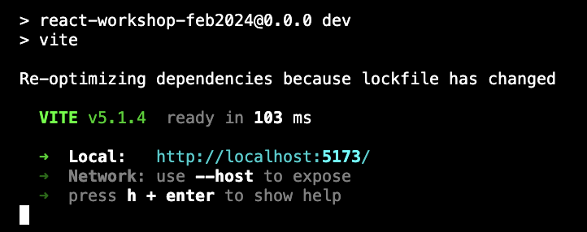

# React workshop

## Get started

### 1. Setup the project

<details>
<summary>I am not a Le Wagon student</summary>
You will need to install the softwares below if not done yet:

- Install NodeJS (https://nodejs.org/en/) version 16 or over

</details>

<details>
<summary>I graduated more than 6 months ago</summary>
You need node v16 or over. Run the following in your terminal:

```bash
nvm install 16.15.1
nvm use 16.15.1
```

</details>
<br>
Follow these steps:

- In your terminal, go to the folder in which you would like to build your react app.

- Then, run the below code:

```bash
gh repo clone yannklein/react-workshop-feb2024
code .
cd workshop
npm install
npm run dev
```

You should see this on your terminal:



- Open `http://localhost:5173/` in your browser, you should see this:


### 2. Setup the your code editor

#### Setup for VS code

Go to `Code > Preferences > Extensions`, search and install "Reactjs code snippets" (some doc here)

#### Setup for Sublime Text

1. Go to `SublimeText > Preferences > Package Control`, search for "Package Control: Install Package" and press Enter. In the appearing list, search for "Babel" and press Enter.

2. Same operations for "Babel Snippets" (some doc here)

3. Got to SublimeText > Preferences > Key Bindings

Add the code of this link on the right side.


## How was this boilerplate created?

The boilerplate has been create with [Vite](https://vitejs.dev/) a lightning fast Frontend framework builder.

To install Vite and create a react boilerplate, run the following code on your terminal:

```
npm create vite@latest
```

You will see a terminal step by step interface that will guide you through the creation process.

For this workshop, I used the following options:
- Project name: `react-workshop-feb2024`
- Select a framework: `React`
- Select a variant: `Javascript`

Then, run the sugggested 3 commands to start up the project.