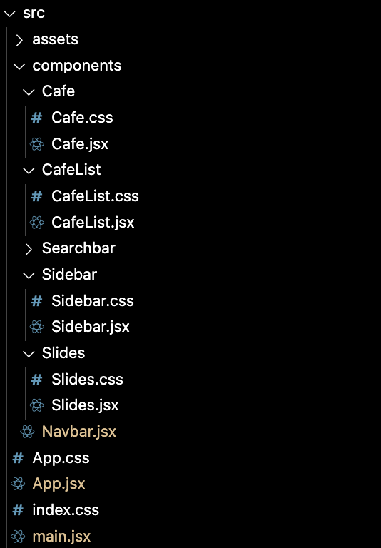

# React workshop
Let's build an app listing dev-friendly cafes in Tokyo ☕️


## React basic usage

#### In the HTML:

```html
  <div id="react-root"></div>
  <script type="module" src="/src/main.jsx"></script>
```

#### In the JSX:

```js
  import * as ReactDOM from 'react-dom/client';

  const rootDiv = document.querySelector("#react-root")
  const root = ReactDOM.createRoot(rootDiv);
  root.render("Hi from React!")
```


## React components

It looks like a function! But it's rendered as a HTML.

```jsx
function Hello() {
    return "Hello";
  }
  root.render(<Hello />)
```

And it can return HTML in JS!! 

The magic of [JSX](https://babeljs.io/repl#) ✨

```jsx
function Hello() {
    return <h1>Hello there!</h1>;
  }
  root.render(<Hello />)
```


## Props

Props are React Component's args/params.

```jsx
  function Hello(props) {
    return `Hello, I am ${props.name} from ${props.country}`;
  }
  root.render(<Hello name="Rosa" country="Guatemala"/>)
```


## Props: Destructure them 🪚

- Destructuring step 1:

```jsx
  function Hello(props) {

    const {name, country} = props;
    // 👆 this is same as doing that 👇
    // const name = props.name;
    // const country = props.country;
    return `Hello, I am ${name} from ${country}`;
  }
  root.render(<Hello name="Rosa" country="Guatemala"/>)
```

- Destructuring step 2:

```jsx
  function Hello({name, country}) {
    return `Hello, I am ${props.name} from ${props.country}`;
  }
  root.render(<Hello name="Rosa" country="Guatemala"/>)
```


## Building a React app


## Step 1: the schema


## Step 2: Create your app structure

Build your components folders, JSX files and, if needed, CSS files.




## Step 3: Populate your components

Use the VS code [React code snippet](https://marketplace.visualstudio.com/items?itemName=xabikos.ReactSnippets) extensions ⚙️
And build your components.

```jsx
import React from 'react';

function Cafe(props) {
  return (
    <div>
      
    </div>
  );
}

export default Cafe;
```


## React advanced concepts


## States with useState

We use our first React Hook 🪝 to create states: 

```jsx

const [students, setStudents] = useState(["Raj", "Trouni", "Tim"])
console.log(students) // => ["Raj", "Trouni", "Tim"]

setStudents(["Eric", "Morty"])
console.log(students) // => ["Eric", "Morty"]

setStudents((currentStudents) => [...currentStudents, "Doug"])
console.log(students) // => ["Eric", "Morty", "Doug"]

```

When states get updated, any component that use them gets re-rendered. A double edge-sword ⚠️


## Escape the re-rendering the effect Hook 🪝

The callback functions of useEffect only renders at the first component rendering.
It also runs everytime its dependencies (often other states) ae changed.

```jsx
const [students, setStudents] = useState(["Raj", "Trouni", "Tim"])
const [counter, setCounter] = useState(0)

React.useEffect(() => {
    setCounter(counter + 1)
}, [students]);
```


## Handle events with React 🎇

The callback functions of useEffect only renders at the first component rendering.
It also runs everytime its dependencies (often other states) ae changed.

```jsx
function Searchbar({setKeyword}) {

  function handleChange(event) {
    setKeyword(event.currentTarget.value)
  }

  return (
    <div className="searchbar input-group">
      <span className="input-group-text"><i className="fa-solid fa-magnifying-glass"></i></span>
      <input placeholder="Starbucks" type="text" className="form-control" onChange={handleChange} />
    </div>
  );
}
```


# Good luck with React! ⚛